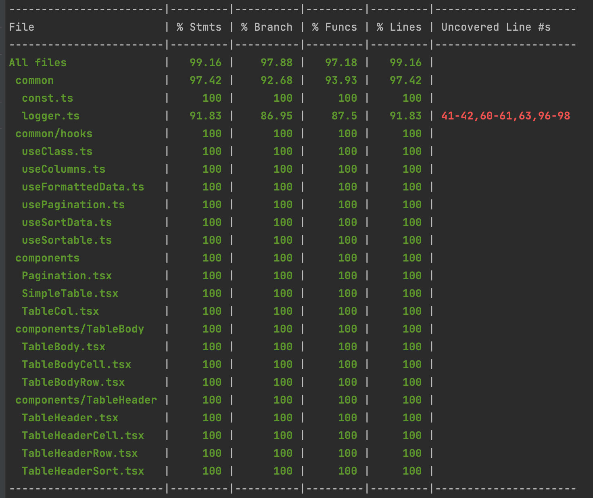
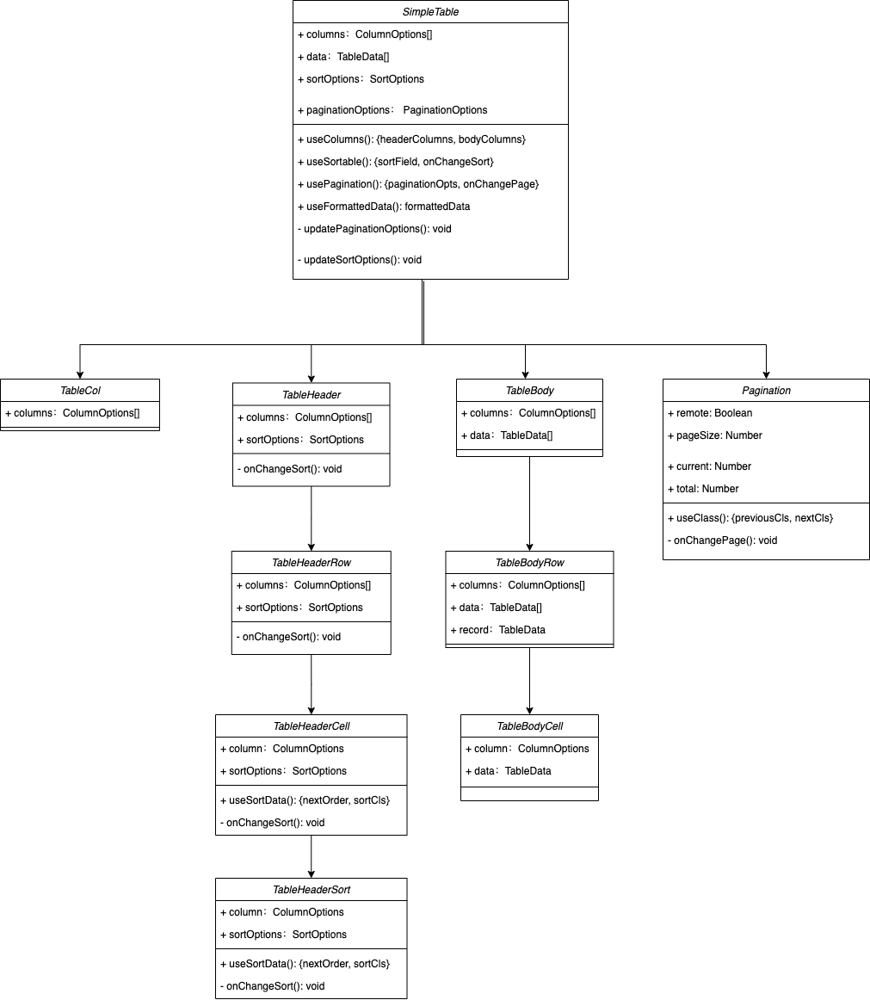

# 表格组件

## 介绍

实现表格组件，**功能**：

- 渲染表头
- 渲染表格主体内容
- 分页功能(上一页，下一页，跳页（输入框输入）)
- 排序功能(顺序/倒叙/恢复无序)

**效果图**


**单测代码覆盖率**



**uml图**



## 代码演示

## API

```vue

<script setup lang="ts">
    import SimpleTable from "./components/SimpleTable";
    import {SORT_ORDER} from './common/const'

    const tableOptions = {
        columns: [
            {header: 'Name', dataIndex: 'name'},
            {header: 'Age', dataIndex: 'age', sortable: true}
        ],
        data: [
            {name: 'Bob', age: '27'},
            {name: 'Tom', age: '20'},
            {name: 'Alice', age: '23'}
        ],
        sortOptions: {
            sortBy: '',
            sortOrder: SORT_ORDER.NONE
        },
        paginationOptions: {
            enable: true,
            limit: 2,
            page: 1
        },
    }

    function updateSortOptions() {
    };

    function updatePaginationOptions() {
    };
</script>

<template>
    <SimpleTable :data="tableOptions.data"
                 :columns="tableOptions.columns"
                 :sortOptions="tableOptions.sortOptions"
                 :paginationOptions="tableOptions.paginationOptions"
                 @updateSortOptions="updateSortOptions"
                 @updatePaginationOptions="updatePaginationOptions">
        <template v-slot:header__name>
            NAME
        </template>

        <template v-slot:body__age="obj">
            {{ obj.data.name + '(' + obj.data.age + ')' }}
        </template>
    </SimpleTable>
</template>

```

### Attribute

| 名称 | 描述 |类型|默认值|可选值|
|----- | ------|------|------|------|
|options | 表格配置项，具体见 表格options配置 | TableProps |  |  |

#### 表格options配置

| 名称 | 描述 |类型|默认值|可选值|
|----- | ------|------|------|------|
|columns | 表格列的配置，具体见 ColumnOptions配置 | ColumnOptions[] |||
|data | 显示的数据 | TableData[] |||
|sortOptions | 排序配置，具体见 sortOptions配置 | SortOptions |||
|paginationOptions | 分页配置，具体见 paginationOptions配置 | PaginationOptions |||

##### ColumnOptions配置

| 名称 | 描述 |类型|默认值|可选值|
|----- | ------|------|------|------|
|header | 表头显示的文案 | string |||
|dataIndex | 表头取值的key | string |||
|sortable | 是否支持排序 | boolean |false|false/true|
|sortFn | 自定义排序函数 | (a: TableData, b: TableData) => number |||
|slot | 表头插槽/列插槽 | TableHeaderSlot & TableBodySlot |||

##### sortOptions配置

| 名称 | 描述 |类型|默认值|可选值|
|----- | ------|------|------|------|
|remote | 是否支持远端排序 | boolean |false|false/true|
|sortBy | 排序列名 | string |||
|sortOrder | 排序顺序 | string ||'NONE'/'ASC'/'DESC'|

##### paginationOptions配置

| 名称 | 描述 |类型|默认值|可选值|
|----- | ------|------|------|------|
|enable | 是否支持分页 | boolean |false|false/true|
|limit | 每页显示条目个数 | number |10||
|page | 当前页 | number |1||
|total | 总条目数 | number |0||
|remote | 是否支持远端分页 | boolean |false|false/true|

### Events

| 名称 | 说明 | 回调参数 |
|----- | ------|------|
|updateSortOptions | 自定义更新排序 |sortOptions|
|updatePaginationOptions | 自定义更新分页 |options|

### Slot

| 名称         | 说明 | 
|------------| ------|
| header__前缀 | 表格头插槽 |
| body__前缀   | 表格列插槽 |
